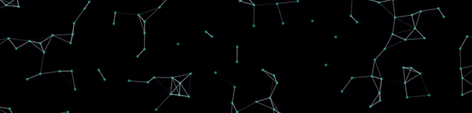
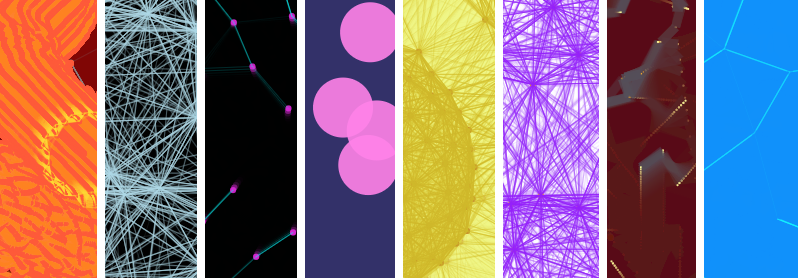

# Constellation



A configurable physics-based animation in JavaScript which can produce many designs and effects, including constellation-like star fields. You can interact with the animation using the mouse or multiple touch points on touch devices.

View a demo here: https://coreyshuman.github.io/Constellation/demo



## Example Usage:

```html
<html>
  <head>
    <meta charset="UTF-8" />
    <meta name="viewport" content="width=device-width, initial-scale=1" />
    <style>
      * {
        margin: 0;
        padding: 0;
      }
      #canvasdiv {
        height: 100%;
      }
    </style>
  </head>
  <body>
    <div id="canvasdiv"></div>
    <script src="constellation.js"></script>
    <script type="text/javascript">
      (function () {
        var constellation = new Constellation({
          canvasContainer: "canvasdiv",
        });
        constellation.init();
        constellation.start();
      })();
    </script>
  </body>
</html>
```

## License

This source code is licensed under the GNU Lesser General Public License v3.0.

Summary of the license terms, per [choosealicense.com](https://choosealicense.com/licenses/lgpl-3.0/#):

> GNU LGPLv3
>
> Permissions of this copyleft license are conditioned on making available complete source code of licensed works and modifications under the same license or the GNU GPLv3. Copyright and license notices must be preserved. Contributors provide an express grant of patent rights. However, a larger work using the licensed work through interfaces provided by the licensed work may be distributed under different terms and without source code for the larger work.

Review the included [LICENSE](/LICENSE) file for full license terms.
